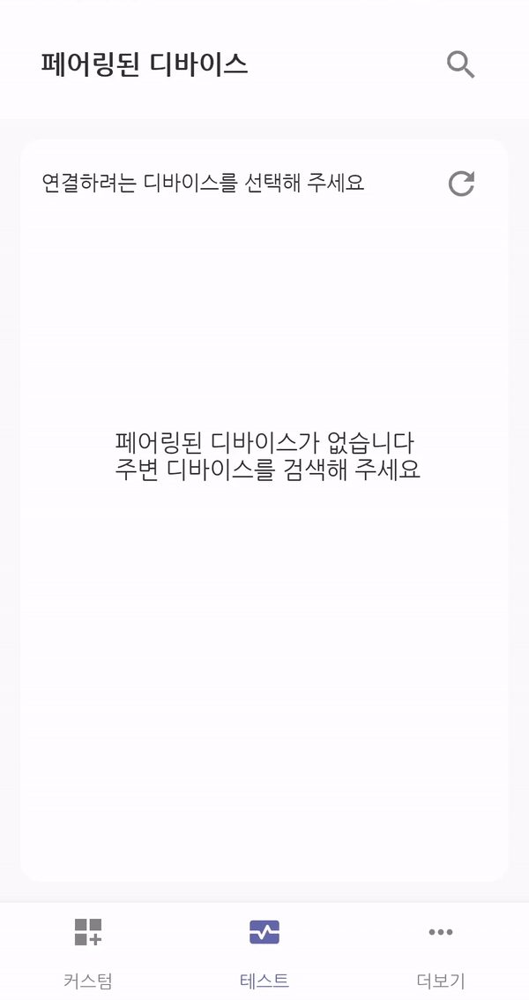
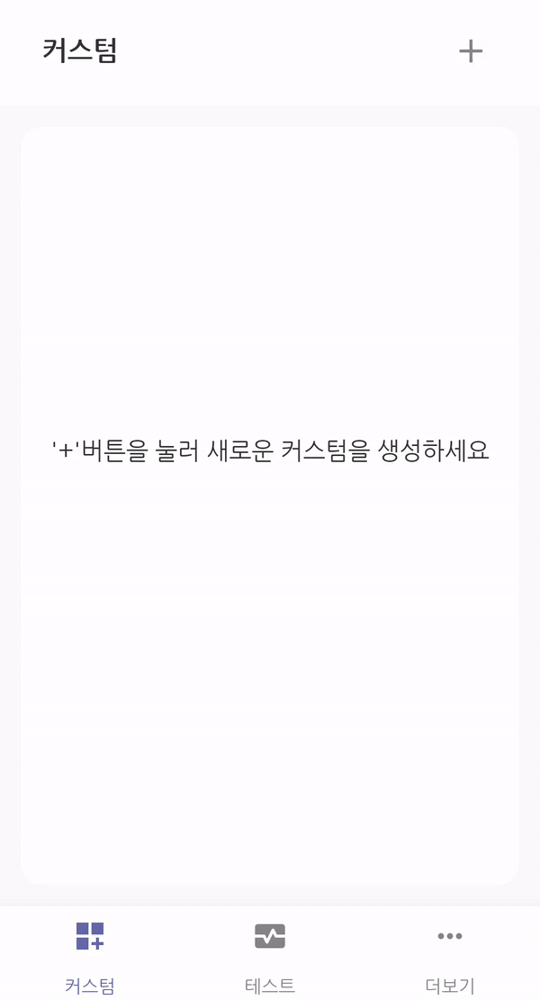
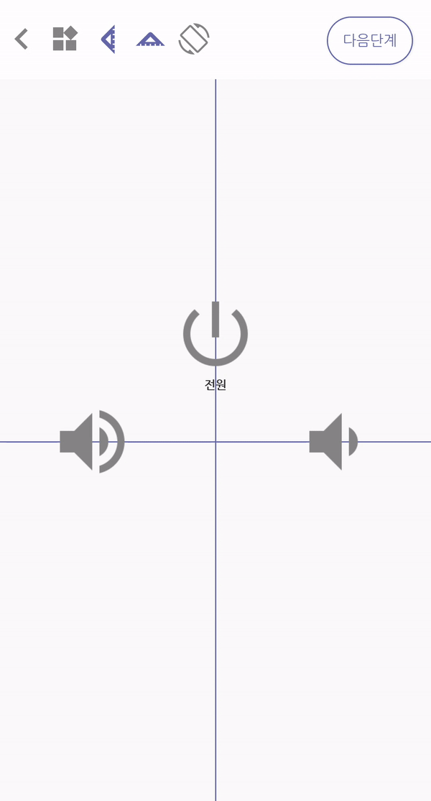
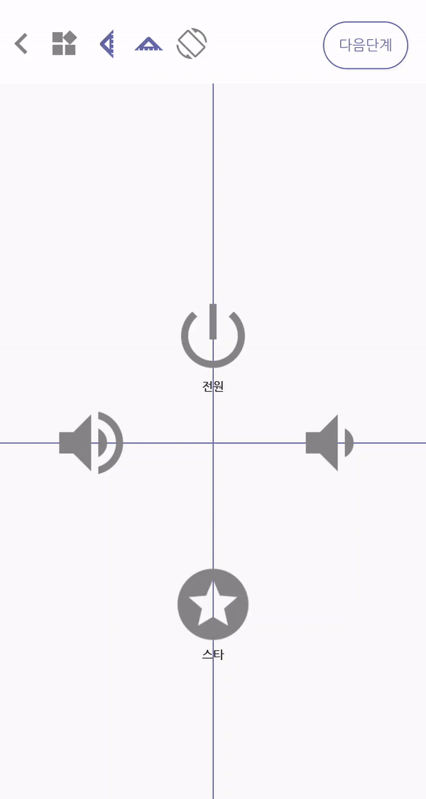
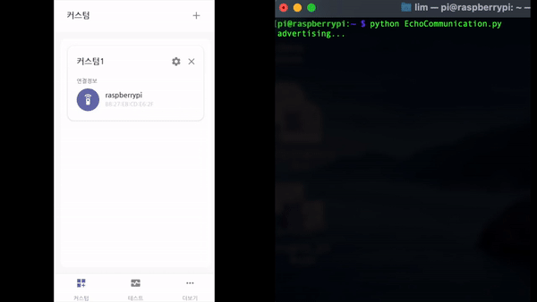
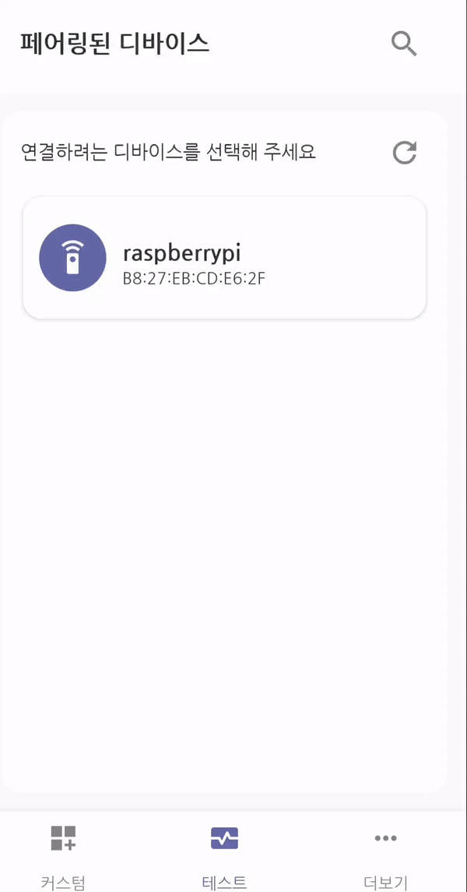
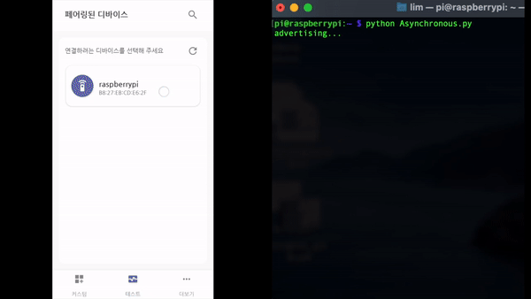

# (Android)blueBerry - 블루투스 원격 제어 시스템
### 개인 프로젝트
### 개발 기간: 2021. 10. 22 ~ 2022. 03. 12

&nbsp;

### :link: Link
|Homepage|Google Play Store|QR Code|
|---|---|---|
||||

&nbsp;

## 목차
[프로젝트 개요](#프로젝트-개요)  
[주요 기능](#주요-기능)  
[주요 기술 스택](#주요-기술-스택)   
[실행 과정](#실행-과정)  
[Spec](#spec)  

&nbsp;

## 프로젝트 개요
* 라즈베리파이, 아두이노 등 임베디드 시스템을 블루투스로 연결하고 양방향 데이터 통신을 지원하는 애플리케이션입니다.
* 채팅 형식으로 메시지를 주고 받으면서 앱과 임베디드 시스템이 제대로 연결되고 소통할 수 있는지 확인할 수 있는 테스트 모드가 있습니다.
* 사용자가 원하는 모양의 리모컨을 직접 제작하여 임베디드 시스템을 원격 제어할 수 있도록 하는 커스텀 모드가 있습니다.

&nbsp;

## 주요 기능
### 커스텀 모드
1. 데이터 연결 없이도 사용 가능한 기본 아이콘과 <b>Google Meterial Icons</b>에서 제공하는 2천 가지 이상의 아이콘을 선택하고 배치하여 원하는 모양의 리모컨을 제작할 수 있습니다.
2. 개별 아이콘마다 이름과 데이터를 설정할 수 있습니다. 아이콘을 터치하면 설정된 데이터가 임베디드 시스템에 전송됩니다.
3. 아이콘이 동일한 수평선/수직선에 배치될 수 있도록 가이드라인을 제공합니다.
4. 한번 만들어진 리모컨은 사용자가 삭제하기 전까지 삭제되지 않으며, 아이콘 재배치, 연결 설정 변경 등의 수정이 가능합니다.

&nbsp;

### 테스트 모드
1. 주변 디바이스 스캔 및 페어링 기능을 지원합니다.
2. 페어링된 디바이스와 연결되면, 채팅 형식의 UI를 통해 데이터를 전송하고 수신되는 과정을 한눈에 파악할 수 있습니다.

&nbsp;

## 주요 기술 스택
### Language
* ### Kotlin
### Android
* ### Android Bluetooth API - 블루투스 디바이스 스캔 및 페어링과 클라이언트 소켓 생성, Serial 통신으로 연결
* ### Thread/Hander - 블루투스 소켓 통신 스레드 및 UI 업데이트를 위한 핸들러
* ### Room Database - 사용자가 생성한 리모컨 저장, 수정, 삭제
* ### Firebase Storage - 2천 가지 이상의 아이콘을 제공하기 위한 외부 저장소
* ### Glide - 아이콘 이미지 표시
* ### Coroutines(CoroutineScope, withContext, launch/Job/join) - DB작업을 위한 비동기 처리
* ### AAC(ViewModel, LiveData, Observer) - MVVM 아키텍쳐

&nbsp;

## 실행 과정
### :arrow_forward: 스캔 및 페어링
* 주변 블루투스 디바이스를 탐색하고 페어링 요청을 보냅니다.  

&nbsp;

### :arrow_forward: 커스텀 리모컨 아이콘 배치
* 아이콘을 선택하고 가이드라인을 통해 적절하게 배치합니다.
* 배치된 아이콘에 이름과 전송될 데이터를 설정합니다.  

&nbsp;

### :arrow_forward: 외부 아이콘 가져오기
* 외부 아이콘을 검색하여 가져옵니다.  

&nbsp;

### :arrow_forward: 리모컨 연결 설정
* 리모컨과 연결될 블루투스 디바이스를 선택합니다.  

&nbsp;

### :arrow_forward: 커스텀된 리모컨으로 통신하기
* 커스텀된 리모컨을 통해 연결된 임베디드 시스템(라즈베리파이, 아두이노 등)을 제어할 수 있습니다.
* 아이콘을 터치하면 데이터가 전송됩니다.
* 전송 데이터와 전송 시간을 기록한 로그를 확인할 수 있습니다.  

&nbsp;

### :arrow_forward: 테스트 모드로 연결 요청하기
* 페어링된 디바이스로 연결 요청을 보냅니다.  

&nbsp;

### :arrow_forward: 테스트 모드로 연결된 디바이스와 채팅하기
* 데이터를 전송하고 수신함으로써 데이터가 제대로 전송되는지 확인합니다.  

&nbsp;

---

## Spec
### 클라이언트(애플리케이션)
* API 21 이상의 안드로이드 OS가 탑재된 스마트폰
  
### 서버(임베디드 시스템)
* Bluetooth Serial Port Profile을 지원하는 모든 블루투스 디바이스
* Raspberry Pi Zero W
* Raspberry Pi Zero 2 W
* Raspberry Pi 3 Model B
* Raspberry Pi 3 Model A+
* Raspberry Pi 3 Model B+
* Raspberry Pi 4 Model B
* HC-05 또는 HC-06 모듈이 부착된 모든 아두이노 제품

