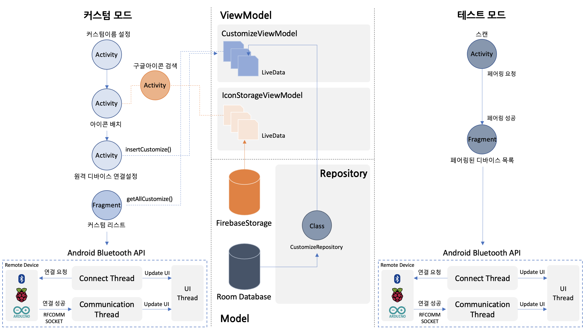

# blueBerry

&nbsp;

|Homepage|Google Play Store|
|---|---|
||
|

&nbsp;

## 목차
---
## 프로젝트 개요
* 라즈베리파이, 아두이노 등 임베디드 시스템을 블루투스로 연결하고 데이터 통신을 지원하는 애플리케이션입니다.
* 클라이언트-서버간의 소켓 연결을 통해 블루투스 시리얼 통신을 수행합니다.
* 메시지를 채팅 형식으로 주고 받을 수 있는 테스트 모드와 사용자가 원하는 모양의 리모컨을 제작하여 임베디드 시스템을 원격 제어할 수 있는 커스텀 모드가 있습니다.
---
## 주요 기능
### 커스텀 모드
1. 데이터 연결 없이도 사용 가능한 기본 아이콘과 <b>Google Meterial Icons</b>에서 제공하는 2천 가지 이상의 아이콘을 선택하고 배치하여 원하는 모양의 리모컨을 제작할 수 있습니다.
2. 개별 아이콘마다 이름과 데이터를 설정할 수 있습니다. 아이콘을 터치하면 설정된 데이터가 임베디드 시스템에 전송됩니다.
3. 아이콘이 동일한 수평선/수직선에 배치될 수 있도록 가이드라인을 제공합니다.
4. 한번 만들어진 리모컨은 사용자가 삭제하기 전 까지 삭제되지 않으며, 아이콘 재배치, 연결 설정 변경등의 수정이 가능합니다.

&nbsp;

### 테스트 모드
1. 주변 디바이스 스캔 및 페어링 기능을 지원합니다.
2. 페어링된 디바이스와 연결되면 채팅 형식의 UI를 통해 데이터가 전송되고 수신되는 과정을 한눈에 파악할 수 있습니다.
---
## 주요 기술 스택
### Android Bluetooth API - 블루투스 디바이스 스캔 및 페어링과 클라이언트 소켓 생성
### Thread/Hander - 블루투스 통신을 위한 스레드 및 UI 업데이트를 위한 핸들러
### Room Database - 커스터마이징 리모컨 저장
### Firebase Storage - 리모컨 커스터마이징을 위한 2천 가지 이상의 아이콘 제공
### Glide - 아이콘 이미지 표시
### Coroutines(CoroutineScope, withContext, launch/Job/join) - 네트워킹 비동기 처리
### AAC(ViewModel, LiveData, Observer) - MVVM 아키텍쳐
---
## 아키텍쳐
### MVVM

---